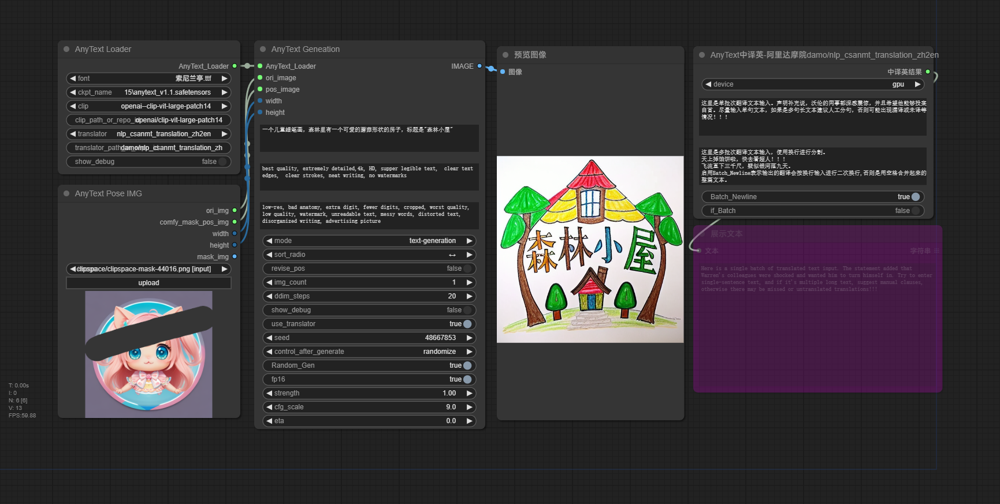

# AnyText非官方的简单粗糙实现  |  [English README](../../README.md)

## 原Repo: [AnyText: Multilingual Visual Text Generation And Editing](https://github.com/tyxsspa/AnyText)

## 警告: 这个插件可能达不到预期。
## 使用说明:

- 个人电脑环境: win10+torch2.2.1+cu121+rtx3050laptop(4GB).
- **输入的图片分辨率必须为64的倍数。** 输入图片最大分辨率建议768x768。
- **如果font、ckpt_name、clip、translator设置为Auto_DownLoad，则会自动下载默认模型到特定目录。如果模型已经存在，则会自动加载。**
- 运行本插件节点时，如果本地没有模型文件，会自动从笑脸(huggingface)下载AnyText模型(fp16: 2.66 GB)到"ComfyUI\models\checkpoints\15\anytext_v1.1.safetensors"。
- 你可以手动从[魔搭(modelscope)-AnyText-FP32-5.73 GB](https://modelscope.cn/models/iic/cv_anytext_text_generation_editing/file/view/master?fileName=anytext_v1.1.ckpt&status=2)下载，然后放到**ComfyUI\models\checkpoints\15**。
- 或者手动从[笑脸(huggingface)-AnyText-FP16-2.66 GB](https://huggingface.co/Sanster/AnyText/blob/main/pytorch_model.fp16.safetensors) 下载并重命名为**anytext_v1.1.safetensors**。然后放到 **ComfyUI\models\checkpoints\15**。
- [clip模型-**clip-vit-large-patch14**](https://huggingface.co/openai/clip-vit-large-patch14)会自动下载到 `C:\Users\username\.cache\huggingface\hub`。可以手动下载[clip模型](https://huggingface.co/openai/clip-vit-large-patch14)放到**ComfyUI\models\clip\openai--clip-vit-large-patch14**。
- 
- 默认字体[font-18MB](https://huggingface.co/Sanster/AnyText/blob/main/SourceHanSansSC-Medium.otf)(SourceHanSansSC-Medium.otf) 会自动从笑脸(huggingface)下载到**ComfyUI\models\fonts**。
- 使用use_translator中译英会自动从[魔搭modelscope--damo\nlp_csanmt_translation_zh2en--7.3GB](https://www.modelscope.cn/models/iic/nlp_csanmt_translation_zh2en)下载模型到`C:\Users\username\.cache\modelscope\hub\damo`。可以手动从前面链接下载，然后把所有文件放到**ComfyUI\models\prompt_generator\nlp_csanmt_translation_zh2en**
- 
- **AnyText模型本身是一个标准的sd1.5文生图模型。**

## 示例提示词:
### 文本生成英文提示词：
- An exquisite mug with an ancient Chinese poem engraved on it, including  "花落知多少" and "夜来风雨声" and "处处闻啼鸟" and "春眠不觉晓"
- Sign on the clean building that reads "科学" and "과학"  and "ステップ" and "SCIENCE"
- An ice sculpture is made with the text "Happy" and "Holidays".Dslr photo.
- A baseball cap with words "要聪明地" and "全力以赴"
- A nice drawing of octopus, sharks, and boats made by a child with crayons, with the words "神奇海底世界"
### 文本编辑英文提示词
- A Minion meme that says "wrong"
- A pile of fruit with "UIT" written in the middle
- photo of clean sandy beach," " " "
### 文本生成中文提示词：
- 一个儿童蜡笔画，森林里有一个可爱的蘑菇形状的房子，标题是"森林小屋"
- 一个精美设计的logo，画的是一个黑白风格的厨师，带着厨师帽，logo下方写着“深夜食堂”
- 一张户外雪地靴的电商广告，上面写着 “双12大促！”，“立减50”，“加绒加厚”，“穿脱方便”，“温暖24小时送达”， “包邮”，高级设计感，精美构图
- 一个精致的马克杯，上面雕刻着一首中国古诗，内容是 "花落知多少" "夜来风雨声" "处处闻啼鸟" "春眠不觉晓"
- 一个漂亮的蜡笔画，有行星，宇航员，还有宇宙飞船，上面写的是"去火星旅行", "王小明", "11月1日"
- 一个装饰华丽的蛋糕，上面用奶油写着“阿里云”和"APSARA"
- 一张关于墙上的彩色涂鸦艺术的摄影作品，上面写着“人工智能" 和 "神经网络"
- 一枚中国古代铜钱,  上面的文字是 "康" "寶" "通" "熙"
- 精美的书法作品，上面写着“志” “存” “高” “远”
### 文本编辑中文提示词:
- 一个表情包，小猪说 "下班"
- 一个中国古代铜钱，上面写着"乾" "隆"
- 一个黄色标志牌，上边写着"不要" 和 "大意"
- 一个建筑物前面的字母标牌， 上面写着 " "
## 示例工作流:



## 部分参数:

### sort_radio: 位置排序,位置排序时的优先级。

- ↕代表Y轴，这个选项会按照遮罩(mask)位置从上到下生成，提示词里面的从开始到结束顺序的字符串(""内的内容)。
- ↔代表X轴，这个选项会按照遮罩(mask)位置从左到右生成，提示词里面的从开始到结束顺序的字符串(""内的内容)。

### revise_pose: 修正位置(仅text-generation模式生效)。

- 尝试通过渲染后的文字行的外接矩形框修正位置，但是这个选项对生成的图片创造性有一定影响。

### Random_Gen: 自动生成随机位置遮罩。

- 根据提示词内字符串数量自动生成遮罩，启用这个选项时pos_img输入不生效。

### comfy_mask_pos_img:

- 使用ComfyUI原生生成的遮罩。

## 鸣谢:

**[Repo: tyxsspa/AnyText](https://github.com/tyxsspa/AnyText)**

```
@article{tuo2023anytext,
      title={AnyText: Multilingual Visual Text Generation And Editing}, 
      author={Yuxiang Tuo and Wangmeng Xiang and Jun-Yan He and Yifeng Geng and Xuansong Xie},
      year={2023},
      eprint={2311.03054},
      archivePrefix={arXiv},
      primaryClass={cs.CV}
}
```
