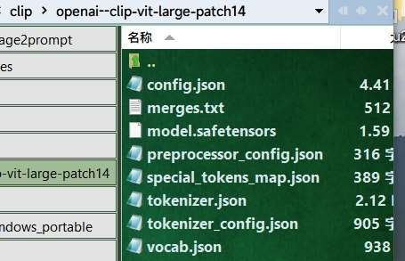

# AnyText非官方的简单粗糙实现  |   [English README](./README.md)

## 原Repo:[AnyText: Multilingual Visual Text Generation And Editing](https://github.com/tyxsspa/AnyText)

## 警告: 这个插件可能达不到预期。

## 使用说明:

- 个人电脑环境: win10+torch2.2.1+cu121.
- **输入的图片分辨率必须为64的倍数。** 输入图片建议最大分辨率768x768。
- 运行本插件节点时，如果本地没有模型文件，会自动从笑脸(huggingface)下载AnyText模型(fp16: 2.66 GB)到"ComfyUI\models\checkpoints\15\anytext_v1.1.safetensors"。
- 你可以手动从[魔搭(modelscope)-AnyText-FP32-5.73 GB](https://modelscope.cn/models/iic/cv_anytext_text_generation_editing/file/view/master?fileName=anytext_v1.1.ckpt&status=2)下载，然后放到**ComfyUI\models\checkpoints\15**。
- 或者手动从[笑脸(huggingface)-AnyText-FP16-2.66 GB](https://huggingface.co/Sanster/AnyText/blob/main/pytorch_model.fp16.safetensors) 下载并重命名为**anytext_v1.1.safetensors**。然后放到 **ComfyUI\models\checkpoints\15**。
- [clip模型-**clip-vit-large-patch14**](https://huggingface.co/openai/clip-vit-large-patch14)会自动下载到 `C:\Users\username\.cache\huggingface\hub`.
- 可以手动下载[clip模型](https://huggingface.co/openai/clip-vit-large-patch14)并放到**ComfyUI\models\clip**，模型文件夹名必须为**openai--clip-vit-large-patch14**。



- 默认字体[font-18MB](https://huggingface.co/Sanster/AnyText/blob/main/SourceHanSansSC-Medium.otf)(SourceHanSansSC-Medium.otf) 会自动从笑脸(huggingface)下载到**ComfyUI\models\fonts**。这个字体必需，因为用它做了判定函数。
- 如果你想使用自己的字体，需要修改**ComfyUI-AnyText\AnyText\scripts\ms_wrapper.py**第236行，替换里面的SourceHanSansSC-Medium.otf为自己放到**ComfyUI\models\fonts**的字体名字(包括后缀)。


- **AnyText模型本身是一个标准的sd1.5文生图模型。**

## 示例提示词:

- An exquisite mug with an ancient Chinese poem engraved on it, including  "花落知多少" and "夜来风雨声" and "处处闻啼鸟" and "春眠不觉晓"
- Sign on the clean building that reads "科学" and "과학"  and "ステップ" and "SCIENCE"
- An ice sculpture is made with the text "Happy" and "Holidays".Dslr photo.
- A baseball cap with words "要聪明地" and "全力以赴"
- A nice drawing of octopus, sharks, and boats made by a child with crayons, with the words "神奇海底世界"

## 示例工作流:


## 部分参数:

### sort_radio: 位置排序,位置排序时的优先级。

- ↕代表Y轴，这个选项会按照遮罩(mask)位置从上到下生成，提示词里面的从开始到结束顺序的字符串(""内的内容)。
- ↔代表X轴，这个选项会按照遮罩(mask)位置从左到右生成，提示词里面的从开始到结束顺序的字符串(""内的内容)。

### revise_pose: 修正位置(仅text-generation模式生效)。

- 尝试通过渲染后的文字行的外接矩形框修正位置，但是这个选项对生成的图片创造性有一定影响。

### Random_Gen: 自动生成随机位置遮罩。

- 根据提示词内字符串数量自动生成遮罩，启用这个选项时pos_img输入不生效。

### comfy_mask_pos_img:

- 使用ComfyUI原生生成的遮罩。

### gr_mask_pos_img: 不建议使用。

- 执行**ComfyUI-AnyText\AnyText\gr_mask_generator.bat**后手动打开一个gradio网页，切换到Text Editing(文字编辑)选项卡，上传图片并生成遮罩。
- 需要修改**bat**文件以指向用户电脑上的**python.exe**位置，然后使用命令安装gradio指定版本包, x:/xx/xx/python.exe -m pip install gradio==3.5.0。


## 鸣谢:

**[Repo: tyxsspa/AnyText](https://github.com/tyxsspa/AnyText)**

```
@article{tuo2023anytext,
      title={AnyText: Multilingual Visual Text Generation And Editing}, 
      author={Yuxiang Tuo and Wangmeng Xiang and Jun-Yan He and Yifeng Geng and Xuansong Xie},
      year={2023},
      eprint={2311.03054},
      archivePrefix={arXiv},
      primaryClass={cs.CV}
}
```
