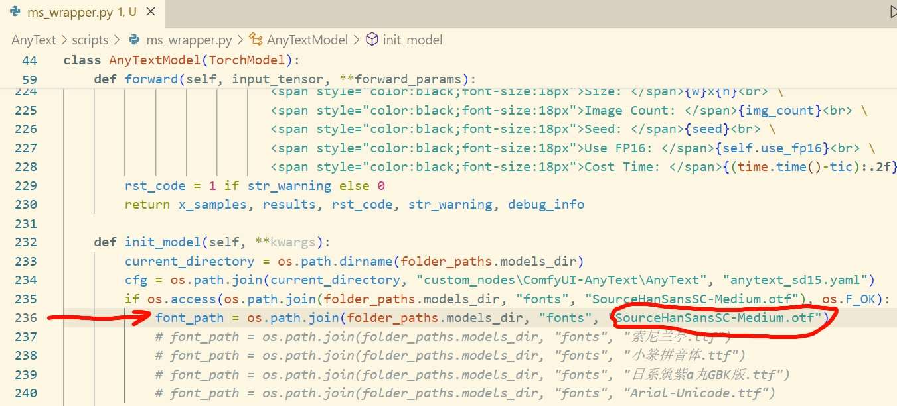
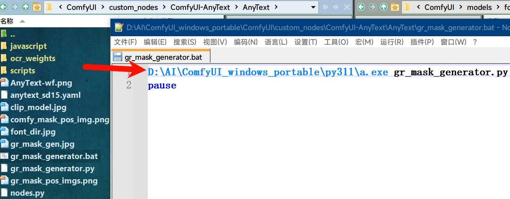

# Unofficial Simple And Rough Implementation Of AnyText  |   [中文README](./README-Zh-CN.md)

## Original Repo:[AnyText: Multilingual Visual Text Generation And Editing](https://github.com/tyxsspa/AnyText)

## Warning: This custom-node will not work well.

## Instructions:

- works on my pc: win10+torch2.2.1+cu121.
- **Input image resolution must be multiple of 64.** Input image max resolution 768x768 Recmmended.
- AnyText model will automatically download into "ComfyUI\models\checkpoints\15\anytext_v1.1.safetensors" from huggingface(fp16: 2.66 GB) when first time executing the node if the model file dose not exist.
- You can download [AnyText-FP32-5.73 GB](https://modelscope.cn/models/iic/cv_anytext_text_generation_editing/file/view/master?fileName=anytext_v1.1.ckpt&status=2) from modelscope,(fp32 5.73 GB).Then put it into **ComfyUI\models\checkpoints\15**.
- Or manually download [AnyText-FP16-2.66 GB](https://huggingface.co/Sanster/AnyText/blob/main/pytorch_model.fp16.safetensors) from huggingface and rename it to **anytext_v1.1.safetensors**.Then put it into **ComfyUI\models\checkpoints\15**.
- clip model [**clip-vit-large-patch14**](https://huggingface.co/openai/clip-vit-large-patch14) will automatically download into `C:\Users\username\.cache\huggingface\hub`.
- You can manually download [clip_model](https://huggingface.co/openai/clip-vit-large-patch14) into **ComfyUI\models\clip**


- A [font-18MB](https://huggingface.co/Sanster/AnyText/blob/main/SourceHanSansSC-Medium.otf) (SourceHanSansSC-Medium.otf) will automatically download into **ComfyUI\models\fonts** from huggingface. It's an essential font that must be in here for check function.
- If you want to change font, u need to change code in **ComfyUI-AnyText\AnyText\scripts\ms_wrapper.py** line-239. Replace **SourceHanSansSC-Medium.otf** with the name of the font you put into **ComfyUI\models\fonts** (including file extension).


- **The AnyText model itself is also a standard sd1.5 text2image model.**
## Example Prompts:

- An exquisite mug with an ancient Chinese poem engraved on it, including  "花落知多少" and "夜来风雨声" and "处处闻啼鸟" and "春眠不觉晓"
- Sign on the clean building that reads "科学" and "과학"  and "ステップ" and "SCIENCE"
- An ice sculpture is made with the text "Happy" and "Holidays".Dslr photo.
- A baseball cap with words "要聪明地" and "全力以赴"
- A nice drawing of octopus, sharks, and boats made by a child with crayons, with the words "神奇海底世界"

## Example workflow:


## Some Params:

### sort_radio: order to draw text.

- ↕ for y axis. It will draw text-content("string") from start-to-end(order) on the mask position from top to bottom.
- ↔ for x axis .It will draw text-content("string") from start-to-end(order) on the mask position from left to right.

### revise_pose: correct text position(only works in gen-mode).

- Which uses the bounding box of the rendered text as the revised position. However, it is occasionally found that the creativity of the generated text is slightly lower using this method, It dosen't work in text-edit mode.

### Random_Gen: automatic generate mask as pos_img.

- Automatically generate mask as pos_img based on the number of text-content("string"). With this checked the pos_img input dosen't work

### comfy_mask_pos_img:

- make a mask with comfyui.

### gr_mask_pos_img: Not Recommend.

- make a mask with gradio web. U need to execute **ComfyUI-AnyText\AnyText\gr_mask_generator.bat** and open a local webpage(Only text-edit tab works) for generating pos_image.
- Also u need to modify the **bat** file make it link to the **python.exe** on your pc. Then install specified version of gradio module with command. x:/xx/xx/python.exe -m pip install gradio==3.5.0.


## Citation:

**[Repo: tyxsspa/AnyText](https://github.com/tyxsspa/AnyText)**

```
@article{tuo2023anytext,
      title={AnyText: Multilingual Visual Text Generation And Editing}, 
      author={Yuxiang Tuo and Wangmeng Xiang and Jun-Yan He and Yifeng Geng and Xuansong Xie},
      year={2023},
      eprint={2311.03054},
      archivePrefix={arXiv},
      primaryClass={cs.CV}
}
```
